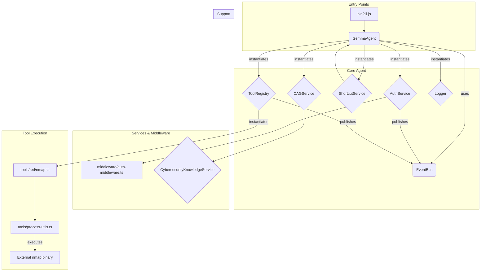

# Core Agent: Consolidated Code Audit & Strategic Recommendations

**Document Version:** 1.0
**Audit Date:** 2025-10-05

## 1. Executive Summary

This document presents a comprehensive architectural and low-level code audit of the Core Agent project. The project is a highly ambitious, feature-rich, and well-architected application designed to serve as an AI-powered cybersecurity assistant.

The overall quality of the codebase is exceptionally high. The architecture is modern, modular, and built on a strong foundation of security best practices. The developers have demonstrated a sophisticated understanding of complex software engineering challenges, particularly in the areas of security, AI integration, and performance optimization.

However, like any complex system, there are areas that present risks or could benefit from improvement. This audit has identified one critical security vulnerability, several instances of incomplete functionality, and opportunities to enhance performance, code quality, and production readiness.

This report provides a detailed analysis of the system's architecture and its core components, followed by a prioritized, actionable roadmap for addressing the identified issues.

---

## 2. Architectural Analysis

### 2.1. System Architecture: Event-Driven and Modular

The Core Agent application is built upon a robust, event-driven, and modular architecture.

-   **Central Orchestrator**: The `GemmaAgent` class acts as the central nervous system, instantiating and coordinating various specialized services.
-   **Separation of Concerns**: Each major function (authentication, caching, tool management, logging) is encapsulated within its own dedicated service class. This is a commendable design that promotes maintainability, testability, and extensibility.
-   **Decoupled Communication**: The `EventBus` (based on Node.js's native `EventEmitter`) serves as the communication backbone, allowing services to interact without being tightly coupled. This is a cornerstone of the system's clean design.

### 2.2. Graph-Aware Component Interaction

A graph-aware analysis reveals a clear and logical flow of control and data:



This graph illustrates a well-structured hierarchy. The `GemmaAgent` is the central node, delegating tasks to specialized services. The `EventBus` enables a loosely coupled system where components can react to events without direct dependencies on the emitters.

---

## 3. Component-Level Audit & Semantic Analysis

### 3.1. Core AI Agent (`gemma3n:4B-agent.ts`)

-   **Assessment**: Excellent. This is a sophisticated orchestrator that successfully integrates all system components.
-   **Strengths**: Strong modular design, clear request processing lifecycle, and robust, configuration-driven behavior.
-   **Weaknesses**: The constructor is overly complex, and there are several uses of the `any` type that reduce type safety.

### 3.2. Authentication & Authorization (`auth-service.ts`, `auth-middleware.ts`)

-   **Assessment**: Excellent. The implementation demonstrates a production-grade understanding of security.
-   **Strengths**: Strong password hashing (`PBKDF2`), timing attack resistance (`timingSafeEqual`), brute-force protection (rate limiting and account lockout), and secure session management with refresh token rotation.
-   **Weaknesses**: A **critical vulnerability** exists in the `migrateLegacyUserCredentials` function, which allows for insecure password handling. The code also suffers from minor issues of synchronous I/O and a broken encapsulation pattern.

### 3.3. Service Layer (`cag-service.ts`, `shortcut-service.ts`)

-   **Assessment**: Good. The `CAGService` is a highlight of the codebase, while the `ShortcutService` is incomplete.
-   **Strengths**:
    -   `CAGService`: A production-ready, multi-layered caching system with vector similarity search, adaptive TTL, and memory-aware eviction. This is an outstanding piece of engineering.
    -   `ShortcutService`: A well-designed, data-driven foundation for managing command shortcuts.
-   **Weaknesses**:
    -   `ShortcutService`: The core execution and security enforcement logic is missing, rendering the service non-functional.
    -   Both services use synchronous I/O, posing a performance risk.

### 3.4. Tool Integration (`tool-registry.ts`, `process-utils.ts`)

-   **Assessment**: Excellent. This is the most secure and well-designed component in the application.
-   **Strengths**: Perfect prevention of command injection vulnerabilities by correctly using `child_process.spawn`. The system is further hardened with defense-in-depth via input validation and robust process management (timeouts and graceful shutdown).
-   **Weaknesses**: Some built-in tools are placeholders with no implementation.

### 3.5. Supporting Architecture (`event-bus.ts`, `logger.ts`)

-   **Assessment**: Adequate. The event bus is perfect, but the logger is suboptimal.
-   **Strengths**: The `EventBus` is a simple, effective use of the native `EventEmitter`.
-   **Weaknesses**: The `Logger` is a custom implementation that lacks critical production features like structured (JSON) logging, asynchronous transports, and log rotation. It is also a performance bottleneck due to its synchronous nature.

---

## 4. Actionable, Step-by-Step Solutions

This section provides a prioritized list of recommendations to address the findings of this audit.

### Priority 1: Critical Security Vulnerability

#### **Task: Remove Legacy Credential Migration**

-   **File**: `services/auth-service.ts`
-   **Problem**: The `migrateLegacyUserCredentials` function and its supporting logic create a severe security risk by handling plaintext passwords.
-   **Solution**:
    1.  Delete the `migrateLegacyUserCredentials` and `resolveLegacyPassword` methods entirely.
    2.  Modify the `loadUsers` method to throw an error if a user record is missing a `passwordHash`, forcing a secure password reset procedure instead of an insecure migration.

-   **Example (`services/auth-service.ts`)**:

    ```typescript
    // Inside the loadUsers method's loop
    for (const userData of usersData) {
      // ...
      if (!user.passwordHash || !user.passwordSalt) {
        // THROW ERROR INSTEAD OF MIGRATING
        throw new Error(`User '${user.username}' has an insecure credential format and must be reset.`);
      }
      this.users.set(user.id, user);
    }
    ```

### Priority 2: Incomplete Core Functionality

#### **Task: Implement `ShortcutService` Execution Logic**

-   **File**: `services/shortcut-service.ts`
-   **Problem**: The `executeCommand` method is a placeholder and does not run any commands.
-   **Solution**: The `ShortcutService` should not execute commands directly. It should translate the shortcut into a natural language query and process it through the `GemmaAgent`. This reuses the agent's core reasoning and security pipeline.

-   **Example**:
    1.  Inject `GemmaAgent` into the `ShortcutService` constructor.
    2.  Implement `executeCommand` to call `gemmaAgent.process()`.

    ```typescript
    // In ShortcutService class
    private gemmaAgent: GemmaAgent; // Assuming GemmaAgent is made available

    private async executeCommand(command: string, args: string[], context?: any): Promise<any> {
      const naturalLanguageQuery = `${command} ${args.join(' ')}`;
      // Use the agent's main processing loop
      return await this.gemmaAgent.process(naturalLanguageQuery, {
        // Pass relevant context, like user session
      });
    }
    ```

### Priority 3: Production Readiness & Performance

#### **Task: Replace Custom Logger with a Production Library**

-   **File**: `utils/logger.ts`
-   **Problem**: The custom logger is synchronous and lacks structured logging.
-   **Solution**: Replace the custom `Logger` class with `pino`. Update all service constructors to instantiate `pino` instead.

-   **Example**:
    1.  `npm install pino`
    2.  Refactor `utils/logger.ts` to export a configured `pino` instance.
    3.  Update a service to use the new logger.

    ```typescript
    // e.g., in services/auth-service.ts
    import pino, { Logger as PinoLogger } from 'pino';

    export class AuthService {
      private readonly logger: PinoLogger;

      constructor(...) {
        // ...
        this.logger = pino({ name: 'AuthService' });
        // ...
      }
    }
    ```

#### **Task: Refactor Synchronous I/O to Asynchronous**

-   **Files**: `services/auth-service.ts`, `services/shortcut-service.ts`
-   **Problem**: Use of `readFileSync` and `writeFileSync` blocks the Node.js event loop.
-   **Solution**: Replace all synchronous file I/O with their `fs/promises` equivalents.

-   **Example (`services/auth-service.ts`)**:

    ```typescript
    import * as fs from 'fs/promises'; // Use promises API

    // In loadUsers method
    private async loadUsers(): Promise<void> { // Make method async
      try {
        if (fs.existsSync(this.usersFile)) { // existsSync is ok for startup
          const data = await fs.readFile(this.usersFile, 'utf8'); // Use await
          // ...
        }
      } //...
    }

    // In saveUsers method
    private async saveUsers(): Promise<void> { // Make method async
      try {
        const usersData = Array.from(this.users.values());
        await fs.writeFile(this.usersFile, JSON.stringify(usersData, null, 2)); // Use await
      } // ...
    }
    ```

### Priority 4: Code Quality & Type Safety

#### **Task: Improve Type Safety (Replace `any`)**

-   **File**: `gemma3n:4B-agent.ts`
-   **Problem**: The use of `any` for `config` and `reasoningPlan` reduces type safety.
-   **Solution**: Define and use specific interfaces for these objects.

-   **Example (`gemma3n:4B-agent.ts`)**:

    ```typescript
    // Define interfaces in types.ts
    export interface AgentConfig {
      sessionId?: string;
      // ... other config properties
    }

    export interface ReasoningPlan {
      steps: { type: string; toolName?: string; simulated?: boolean; simulationResult?: string; }[];
    }

    // Use interfaces in GemmaAgent
    constructor(config?: AgentConfig) { /* ... */ }

    private async validateToolPermissions(reasoningPlan: ReasoningPlan): Promise<void> { /* ... */ }
    ```

#### **Task: Fix Encapsulation Breach in `AuthMiddleware`**

-   **File**: `middleware/auth-middleware.ts`, `services/auth-service.ts`
-   **Problem**: `AuthMiddleware` accesses a private method of `AuthService` via bracket notation.
-   **Solution**: Create a public `logAuditEvent` method in `AuthService` and call it directly from the middleware.

-   **Example (`services/auth-service.ts`)**:

    ```typescript
    // Make a public method for logging
    public async logEvent(
      context: { userId: string; username: string; sessionId: string; },
      action: string,
      resource: string,
      details: Record<string, any> = {}
    ): Promise<void> {
      await this.logAuditEvent({
        userId: context.userId,
        username: context.username,
        action,
        resource,
        details,
        sessionId: context.sessionId,
        success: true,
        duration: 0
      });
    }
    ```

---

## 5. Conclusion

The Core Agent project is an impressive piece of software with a strong, secure, and well-considered architecture. It stands on a solid foundation.

The most critical action item is the immediate removal of the insecure legacy credential migration feature. Following that, completing the `ShortcutService` implementation will close a major functionality gap. The remaining recommendations—migrating to a production logger, adopting asynchronous I/O, and improving type safety—will elevate the project from a high-quality prototype to a truly production-grade, enterprise-ready system.

By implementing these strategic recommendations, the Core Agent project can confidently build upon its excellent foundation to achieve its ambitious goals.